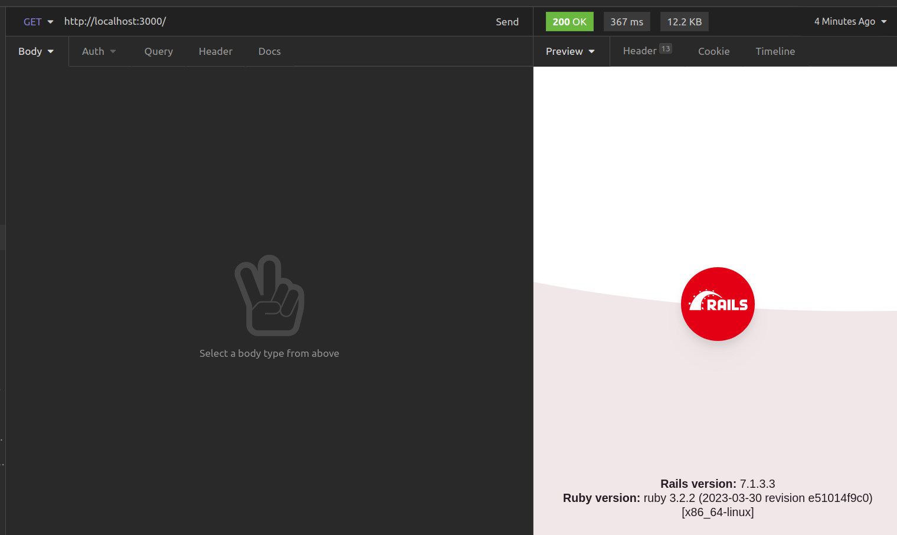

# Product Api

## WIP
This is a RESTful api that import a spreadsheet and process it in background

## Setup

Be sure you have docker and docker-compose installed.

### Step 1 - Build the containers

`docker-compose build`

### Step 2 - Create the databases

`docker-compose run web bin/rails db:create`
`docker-compose run web bin/rails db:create RAILS_ENV=test`

``` bash
[+] Running 1/1
 ⠿ Container products-api-db-1  Created
[+] Running 1/1
 ⠿ Container products-api-db-1  Started
```

### Step 3 - Run the migrations

`docker-compose run web bin/rails db:migrate`
`docker-compose run web bin/rails db:migrate RAILS_ENV=test`

### Step 4 - Up the server
Finally you can up the server

`docker-compose up`

Access [localhost:3000 ](http://localhost:3000) using a API client



